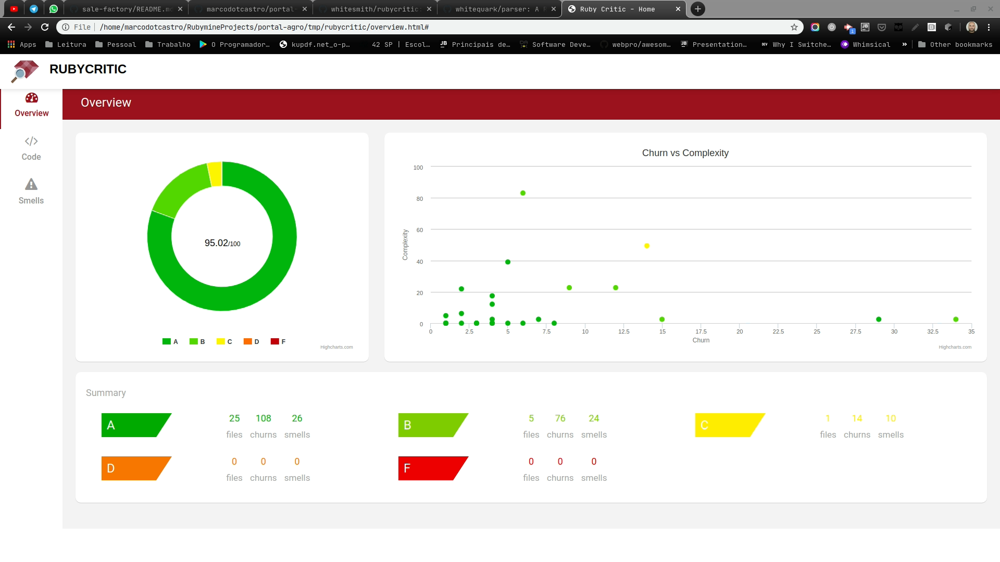
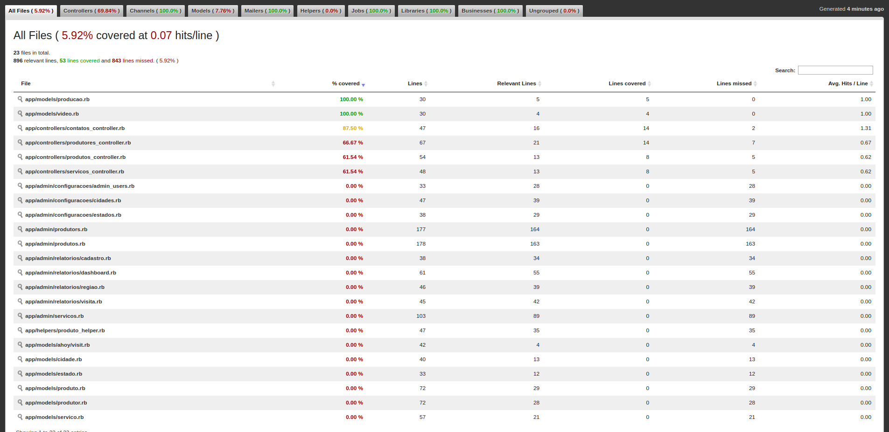

# Informações Negociais

Video de Apresentação do Negócio, clique na imagem

[](https://www.youtube.com/watch?v=_bOqoXSPfUs)

[Apresentação Completa no Prezi](https://prezi.com/p/_rif-zlt6law/?present=1)

## Principais Funcionalidades

Video de Apresentação das Funcionalidades, clique na imagem

[](https://www.youtube.com/watch?v=0rfxWGPf_gM)

# Informações Técnicas

## Variáveis de Ambiente

### Image Server
- ENV['AWS_ACCESS_KEY_ID']
- ENV['AWS_SECRET_ACCESS_KEY_ID']
- ENV['AWS_REGION']
- ENV['AWS_BUCKET']

## Running

> Clone o projeto

> Instale o ruby 2.6.6

> Agora execute

```
bundle install
rails db:create
rails db:migrate
rails db:seed 
rails s
```

## Qualidade

### Qualidade de Código
```
shell> rake rubycritic app
```
Acesse: HOME_PROJECT/tmp/rubycritic/overview.html

Configuração -- lib/tasks/rubycritic.rake



## Cobertura de Código
```
shell> rake rubycritic app
```
Acesse: HOME_PROJECT/coverage/index.html



## Infraestrutura

- [Amazon S3](https://s3.console.aws.amazon.com/s3/buckets/active-storage-portal-agro/?region=us-east-2&tab=overview)
- [Amazon IAM](https://console.aws.amazon.com/iam/home?region=us-east-2#/users)
