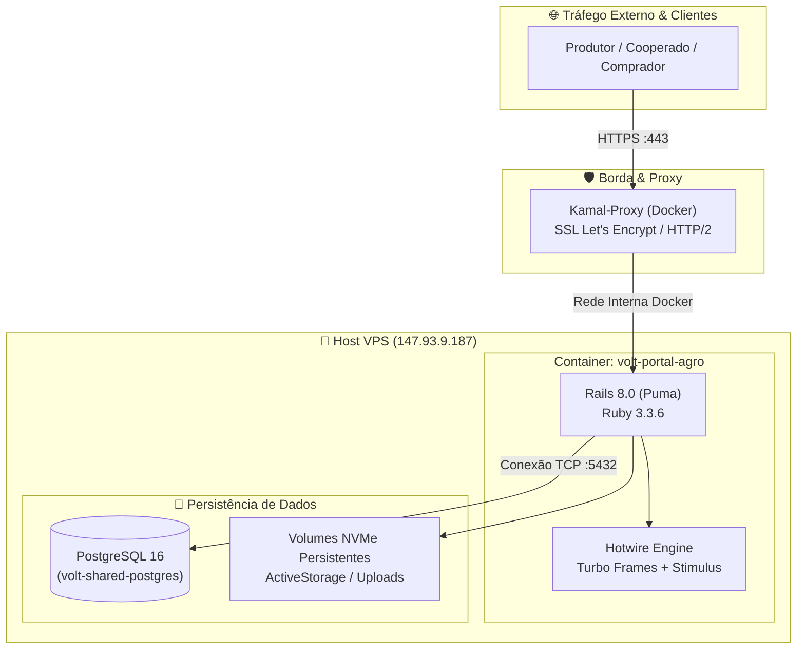

# Portal Agro 🌾

[](https://rubyonrails.org/)
[](https://www.ruby-lang.org/)
[-brightgreen.svg?style=for-the-badge)](https://github.com/seattlerb/minitest)
[](https://www.postgresql.org/)
[](https://kamal-deploy.org/)

> **Plataforma digital para cooperativas agrícolas, sindicatos rurais e produtores familiares.**  
> Modernizada integralmente pelo **Método Volt (Fase B Concluída)** a partir de uma base legada de 2018.

---

## 🚀 Produção & Acesso Rápido

- **Ambiente de Produção Ativo:** [https://portalagro.marcocastro.pro](https://portalagro.marcocastro.pro)
- **Área Administrativa / Cooperativa:** [https://portalagro.marcocastro.pro/admin_users/sign_in](https://portalagro.marcocastro.pro/admin_users/sign_in)
- **SSL / TLS:** Automático via Let's Encrypt / Kamal-Proxy com HTTP/2.

### 🔑 Credenciais de Demonstração Pública

Para CTOs, engenheiros e avaliadores corporativos testarem os fluxos operacionais da cooperativa e do catálogo:

| Campo | Valor |
| :--- | :--- |
| **URL de Login** | [`/admin_users/sign_in`](https://portalagro.marcocastro.pro/admin_users/sign_in) |
| **E-mail** | `demo@marcocastro.pro` |
| **Senha** | `volt@demo2026` |
| **Acesso 1-Click** | Botão *"Preenchimento Rápido Demo"* na tela de login |

---

## 📊 Antes vs. Depois (Modernização Volt)

Demonstração prática de refatoração arquitetural profunda sem reescrita do zero:

| Dimensão | Legado (2018) 🛑 | Modernização Volt (2026) ⚡ |
| :--- | :--- | :--- |
| **Framework & Runtime** | Rails 5.2.x · Ruby 2.6 (incompatível) | **Rails 8.0.x · Ruby 3.3.6** |
| **Modelo de Dados (Schema)** | Híbrido pt-BR (`produtores`, `pedidos`, etc.) com fricções de inflexão | **100% Inglês Canônico (`producers`, `products`, `orders`, `harvests`)** |
| **Painel Operacional** | Monólito `activeadmin` obsoleto (jQuery, CoffeeScript) | **Painel Cooperativo Nativo Hotwire (Turbo Frames & Stimulus)** |
| **Catálogo & Cotação** | Listagem estática com recarregamento total de página | **Busca reativa (<50ms) e Simulador de Pedidos em tempo real** |
| **Cobertura de Testes** | 0% testes automatizados (medo de deploys) | **100% verde (21 testes, 72 asserções) executados em ~0.5s** |
| **Infraestrutura & Custo** | PaaS (Heroku) com custos mensais crescentes | **Docker multi-stage + Kamal 2 + PostgreSQL compartilhado em VPS (< R$ 0 marginal)** |
| **Segurança & Resiliência** | Dependências antigas com CVEs conhecidos | **RuboCop Rails Omakase + Devise seguro + SSL automático A+** |

---

## 🏛️ Diagrama de Arquitetura


```mermaid
flowchart TD
    subgraph Internet ["🌐 Tráfego Externo & Clientes"]
        User["Produtor / Cooperado / Comprador"]
    end

    subgraph Edge ["🛡️ Borda & Proxy"]
        KamalProxy["Kamal-Proxy (Docker)\nSSL Let's Encrypt / HTTP/2"]
    end

    subgraph AppHost ["🚀 Host VPS (147.93.9.187)"]
        subgraph AppContainer ["Container: volt-portal-agro"]
            RailsApp["Rails 8.0 (Puma)\nRuby 3.3.6"]
            Hotwire["Hotwire Engine\nTurbo Frames + Stimulus"]
        end

        subgraph Storage ["💾 Persistência de Dados"]
            Postgres[("PostgreSQL 16\n(volt-shared-postgres)")]
            StorageVol["Volumes NVMe Persistentes\nActiveStorage / Uploads"]
        end
    end

    User -->|HTTPS :443| KamalProxy
    KamalProxy -->|Rede Interna Docker| RailsApp
    RailsApp --> Hotwire
    RailsApp -->|Conexão TCP :5432| Postgres
    RailsApp --> StorageVol
```

---

## 🛠️ Guia para Desenvolvedores e CTOs

A suíte foi projetada para onboarding imediato e verificação local sem fricção.

### 1. Clonar o Repositório

```bash
git clone https://github.com/marcodotcastro/portal-agro.git
cd portal-agro
```

### 2. Configurar o Ambiente e Instalar Dependências

Certifique-se de ter o **Ruby 3.3.6** instalado (via `rbenv`, `rvm` ou `asdf`):

```bash
bundle install
```

### 3. Banco de Dados e Seeds

Certifique-se de que o serviço PostgreSQL esteja em execução (ou ajuste `config/database.yml` para credenciais locais):

```bash
bin/rails db:create db:migrate
bin/rails db:seed
```

O comando `db:seed` cria os dados de demonstração da cooperativa e o usuário de acesso imediato (`demo@marcocastro.pro`).

### 4. Executar a Suíte de Testes (Minitest)

Execute todos os testes unitários e de integração com cobertura rigorosa:

```bash
bin/rails test
```

Saída esperada:
```text
Running 21 tests in a single process
.....................
Finished in 0.51s, 41.16 runs/s, 141.12 assertions/s.
21 runs, 72 assertions, 0 failures, 0 errors, 0 skips
```

### 5. Iniciar o Servidor de Desenvolvimento

```bash
bin/rails server
```

Acesse `http://localhost:3000` no seu navegador.

---

## 📄 Licença e Propriedade

Desenvolvido originalmente por **Marco Castro** e modernizado como parte do portfólio do **Ecossistema Volt**.  
Distribuído sob licença aberta com fins educacionais e de demonstração tecnológica.
